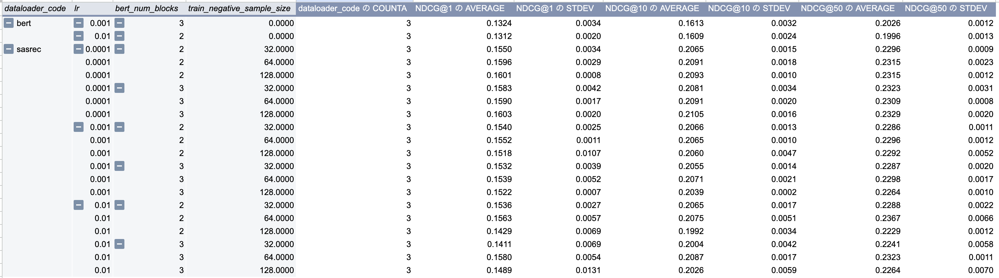

# text4rec: A Framework for Text-Enhanced Sequential Recommendation

This repository contains the code for `text4rec`, a framework for building and experimenting with sequential recommendation models that leverage text-based item embeddings.

## Architecture

The general architecture involves using pre-trained text embeddings to represent items, which are then fed into a sequential model to learn user preferences.


### Key Improvements

## Setup

This project uses [Poetry](https://python-poetry.org/) for dependency management.

1.  **Install Poetry:** Follow the instructions on the [official website](https://python-poetry.org/docs/#installation).

2.  **Install Dependencies:** From the root of the project directory, run:
    ```bash
    poetry install
    ```
    This will create a virtual environment and install all the necessary packages defined in `pyproject.toml`.

## Usage

### Datasets

This framework supports multiple datasets:

-   **Amazon Review Data:** Used for the text-enhanced models (`t4r.yaml`, `sasrec.yaml`). The model leverages rich text information from this dataset to generate item embeddings. The dataloader will automatically download the data specified in the config file.
-   **MovieLens:** Used for the baseline BERT4Rec model (`b4r.yaml`).

### Running Experiments

The main experiments can be reproduced by running the `experiment.sh` script.

```bash
./cmd/experiment.sh
```

This script runs a series of experiments defined within it. Each line calls `sandbox/run_and_log.sh` with a specific configuration file and hyperparameters.

The core configurations are located in the `params/` directory:
-   `b4r.yaml`: Configuration for the baseline BERT4Rec model.
-   `t4r.yaml`: Configuration for the text-enhanced BERT4Rec model (T4R).
-   `sasrec.yaml`: Configuration for our proposed the text-enhanced gSASRec model.

You can modify `cmd/experiment.sh` to run different experiments or create new `.yaml` configuration files to test different models and hyperparameters.

## Results

The following chart compares the performance of our proposed text-enhanced gSASRec model against the baseline B4R model, demonstrating a significant improvement in recommendation accuracy.


